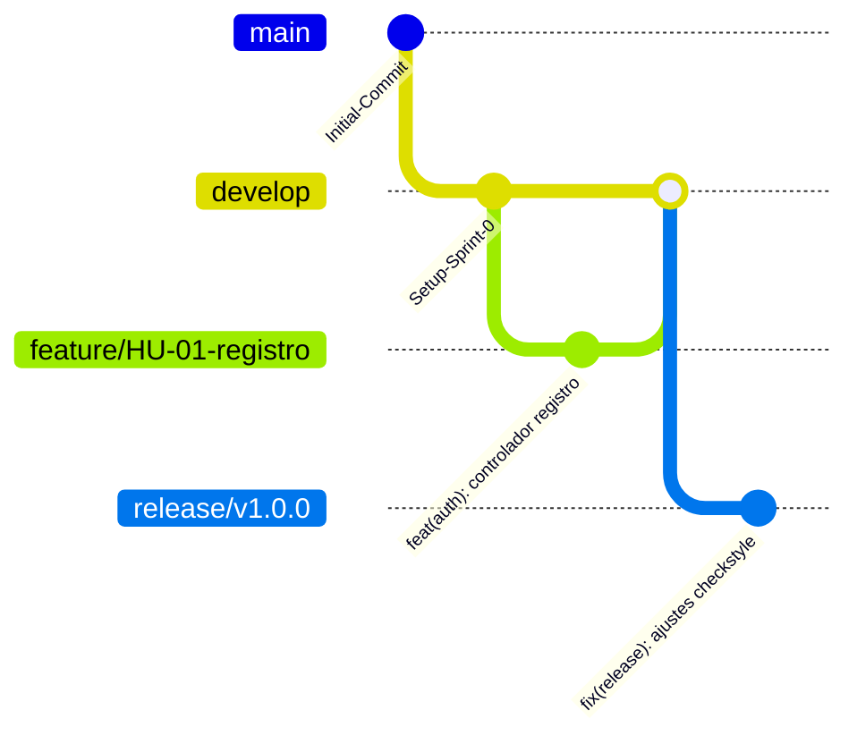

# AgroValle Connect - Sistema de Conexión Agrícola Regional 

[](https://www.oracle.com/java/)
[](https://spring.io/projects/spring-boot)
[]()

Descripción y Declaración de Visión del Producto
Para los **productores agrícolas del Valle del Cauca**, que necesitan **vender directamente sus cosechas sin intermediarios**, **AgroValle Connect** es una **plataforma web en Java / Spring Boot** que **conecta la oferta y la demanda comercial a un precio justo y en tiempo real**. A diferencia de los **intermediarios tradicionales**, nuestro producto **garantiza trazabilidad, programación logística y contratos de API transparentes**.

---

 Integrantes del Equipo
* **Emmanuel Vidal Moreno**
* **Josse Manuel Bolaños**
* **Michael David Robayos**

---

 Estrategia de Control de Versiones (GitFlow)

Adoptamos la estrategia **GitFlow** para asegurar lanzamientos versionados estables, permitiendo el trabajo aislado mediante *feature branches* asignadas a cada Historia de Usuario (HU), evitando la contaminación de la rama de producción (`main`).

### Justificación Técnica
* **Aislamiento Total:** Ningún código entra a `main` sin haber pasado por una revisión por pares (Peer Review / Pull Request) y las pruebas automatizadas del pipeline CI/CD.
* **Control de Calidad:** Garantiza que solo los incrementos con un estado de *Readiness* validado bajo normas ISO/IEC 25010 lleguen a despliegue.


```bash
# 1. Clonar el repositorio
git clone [https://github.com/josse164/agrovalle-connect.git](https://github.com/josse164/agrovalle-connect.git)
cd agrovalle-connect

# 2. Compilar y verificar reglas de estilo (Checkstyle)
mvn clean verify

# 3. Ejecutar la aplicación
mvn spring-boot:run
```
    merge release/v1.0.0 tag: "v1.0.0"
    checkout develop
    merge release/v1.0.0
